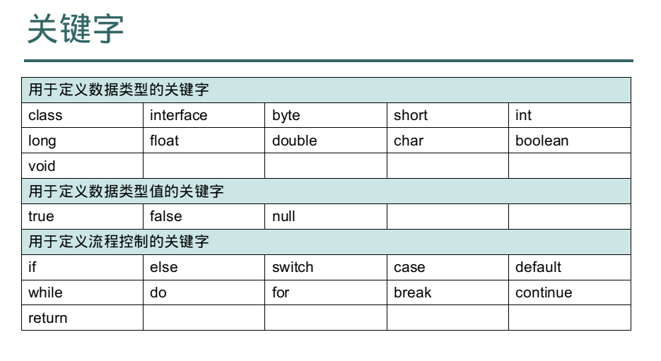
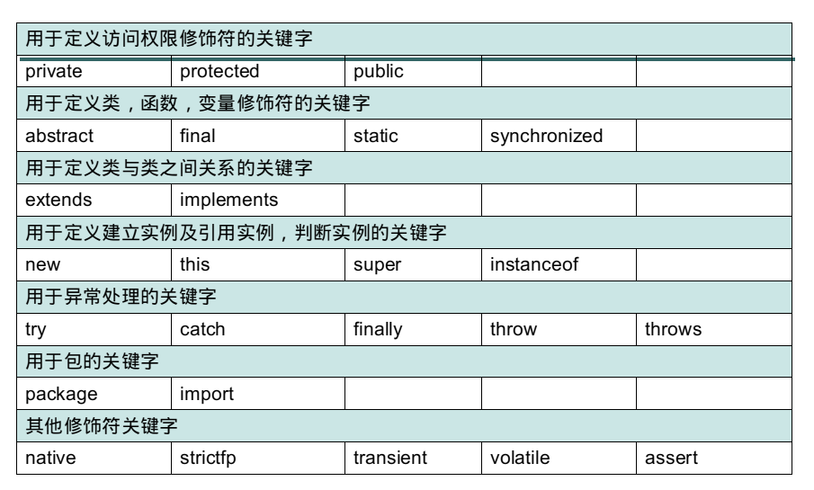

# Java 基础语法

## 关键字

被Java语言赋予特定含义的单词, 组成关键字的字母全部小写





## 注释

```java
/*多行注释
多行注释
多行注释
*/

// 单行注释

/**
文档注释
*/
```

## 数据类型

### 基本数据类型(4类8种)

1. byte(1), short(2), int(4), long(8)
2. float(4), double(4)
3. char(2)
4. boolean(1)

#### 注意:

1. 整数默认int, 
2. 小数默认float
3. 作用域: 大括号范围内, 不能有同名变量
4. 没有初始化值的变量不能直接使用