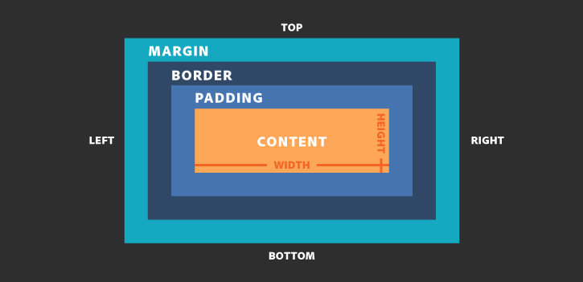

# CSS Basics

### How to relationship the css file in html file?

```html
<head>
	<link rel="stylesheet" href="/css/master.css">
</head>
```


### Comment

```css
/* Anything in here is a comment */
```

### Color

```css
selector {
    color: red;
    /*
    Can search color picker on bing.com get other color
    color: #7ced5a;
    color: rgb(124,237,90);
    color: rgba(124,237,90,0.5);
    */
}
```

### Background

```css
selector {
    background-color: gray;
    /*
    background-image: url(image.png);
    background-repeat: no-repeat; repeat; repeat-x; repeat-y; round; space;
    */
}
```

#### Background 简写

```css
/*
background-color
background-position
background-size
background-repeat
background-origin
background-clip
background-attachment
background-image
如果不设置其中的某个值，也不会出问题
*/
body {
    background: #00FF00 url(bgimage.gif) no-repeat fixed top;
}
```

### Border

```css
div {
    border-color: orange;
    border-width: 1px; /* medium; thin; thick; */
    /* dashed; groove; hidden; dotted; none; ridge; solid; */
    border-style: double; 
    
}
```

#### Border 简写

```css
selector {
    border: medium double rgb(250,0,255);
}
```

### Text

```css
selector {
    text-decoration: line-through;/*删除线 overline;上划线 cursive; underline 下划线*/
    text-align: center;
    line-height: 100px; /*line-height=height can vertical Center*/
    text-indent: 2em; /*首行缩进*/
    text-transform: lowercase; upercase; capitalize/*文本的形式，大写？小写？首字母大写？*/
    /*文本超出部分，用...显示*/
    white-space: nowrap; /*不换行 normal 正常换行*/
    overflow: hidden; /*超出部分隐藏*/
    text-overflow: ellipsis; /*文本超出部分使用...显示*/
}
```

### Font

```css
selector {
    font-family: 'Arial'; /* monospace; */
    /*1em = 16px(default font size) 2em = 32px*/
    font-size: 10px;
    font-style: italic;
    font-weight: bold;
}
```

#### 自定义字体

1. [Google Fonts](http://www.googlefonts.cn/)
2. [CSS Font Stack](https://www.cssfontstack.com/)

### 配色方案生成器

[The super fast color schemes generator!](https://coolors.co/)

### 阿里图标
[iconfont](http://www.iconfont.cn/)

### Selectors

```html
<div class='divFirst_class' id="divFirst_id">
	
    <ul>
        <li>item 1</li>
        <li>item 2</li>
        <li>item 3</li>
    </ul>
    <h4>Heading 4</h4>
    <p>This is a paragraph.</p>
    <a href="https://www.baidu.com">Baidu</a>
    <a href="https://cn.bing.com">Bing</a>
</div>
```

```css
/* id 选择器 */
#divFirst_id {
    border: thin dotted pink;
}

/* 类选择器 */
.divFirst_class {
    border: thin dotted pink;
}

/* 通配符选择器 */
* {
    color: black;
}

/* 相邻兄弟选择器

1. 同一父元素下
2. 选择紧接在一个元素后面的元素
*/
div li + li {
    /* item2 and item3 will be choose */
    color: red;
}
h4 + p {
    /* p will be choose */
    text-decoration: line-through;
}

/* 后代选择器 */
div ul li {
    color: green;
}

/* 属性选择器 */
.divFirst_class a[href="https://cn.bing.com"] {
    color: purple;
}

/* 伪类 */
a:link {color: #FF0000}		/* 未访问的链接 */
a:visited {color: #00FF00}	/* 已访问的链接 */
a:hover {color: #FF00FF}	/* 鼠标移动到链接上 */
a:active {color: #0000FF}	/* 选定的链接 */

/*Specificity cover css style
tag < class < id

*/

```


### Box Model


1. padding 调整的是盒子自身的大小，会撑大盒子。
2. 嵌套div时，外部div如果没有设置border, 则内部div的margin设置时会一直往上找，直到找到边界位置。
3. 相邻div间的margin，取值为两个div各自设置margin的最大值，而不是相加值。

### 浮动

###  定位

1. 固定定位 - 将元素固定在 Screen 的指定位置

   ```css
   /*css*/
   div {
       height: 200px;
       width: 200px;
       position: fixed;
       right: 20px;
       bottom: 50px;
       /*
       left,top also do the same thing
       */
   }
   ```

2. 相对定位 - 相对于自身原来的位置定位，不会脱离文档流

   ```css
   div {
       height: 200px;
       width: 200px;
       position: relative;
       right: 20px;
       bottom: 50px;
       /*
       left,top also do the same thing
       */
   }
   ```

3. 绝对定位 - 参照于已经定位的父元素或浏览器进行定位，会脱离文档流

   ```css
   /*相对浏览器进行绝对定位*/
   div {
       height: 200px;
       width: 200px;
       position: absolute;
       right: 20px;
       bottom: 50px;
       /*
       left,top also do the same thing
       */
   }
   ```

   ```css
   /*父相子绝（父元素相对定位，子元素相对父元素绝对定位）*/
   .outer {
       width: 200px;
       height: 200px;
       background: red;
       position: relative;
   }
   
   .inner {
       width: 200px;
       height: 200px;
       background: green;
       position: absolute;
       right: 20px;
       bottom: 10px;
   }
   /*只有使用绝对定位的元素使用该值才有用*/
   /*z-index: 10; 控制层级，数值越大，层级越高（可以被看见）*/
   ```

   


### Tools

1. Google Browser Inspect

2. [Reset CSS](https://meyerweb.com/eric/tools/css/reset/)

   ```css
   /* http://meyerweb.com/eric/tools/css/reset/ 
      v2.0 | 20110126
      License: none (public domain)
   */
   
   html, body, div, span, applet, object, iframe,
   h1, h2, h3, h4, h5, h6, p, blockquote, pre,
   a, abbr, acronym, address, big, cite, code,
   del, dfn, em, img, ins, kbd, q, s, samp,
   small, strike, strong, sub, sup, tt, var,
   b, u, i, center,
   dl, dt, dd, ol, ul, li,
   fieldset, form, label, legend,
   table, caption, tbody, tfoot, thead, tr, th, td,
   article, aside, canvas, details, embed, 
   figure, figcaption, footer, header, hgroup, 
   menu, nav, output, ruby, section, summary,
   time, mark, audio, video {
   	margin: 0;
   	padding: 0;
   	border: 0;
   	font-size: 100%;
   	font: inherit;
   	vertical-align: baseline;
   }
   /* HTML5 display-role reset for older browsers */
   article, aside, details, figcaption, figure, 
   footer, header, hgroup, menu, nav, section {
   	display: block;
   }
   body {
   	line-height: 1;
   }
   ol, ul {
   	list-style: none;
   }
   blockquote, q {
   	quotes: none;
   }
   blockquote:before, blockquote:after,
   q:before, q:after {
   	content: '';
   	content: none;
   }
   table {
   	border-collapse: collapse;
   	border-spacing: 0;
   }
   ```

   


### 常用样式

1. 导航栏样式

   ```css
   ul {
       list-style: none;
   }
   li {
       height:30px;
       width: 30px;
       background: green;
       margin-left:20px;
       float: left;
   }
   ```

2. 解决高度塌陷问题

   ```css
   /*解决父盒子由于嵌套盒子浮动而高度塌陷的问题*/
   .clearfix::after {
       display: block;
       clear: both;
       content: '';
   }
   ```

   
