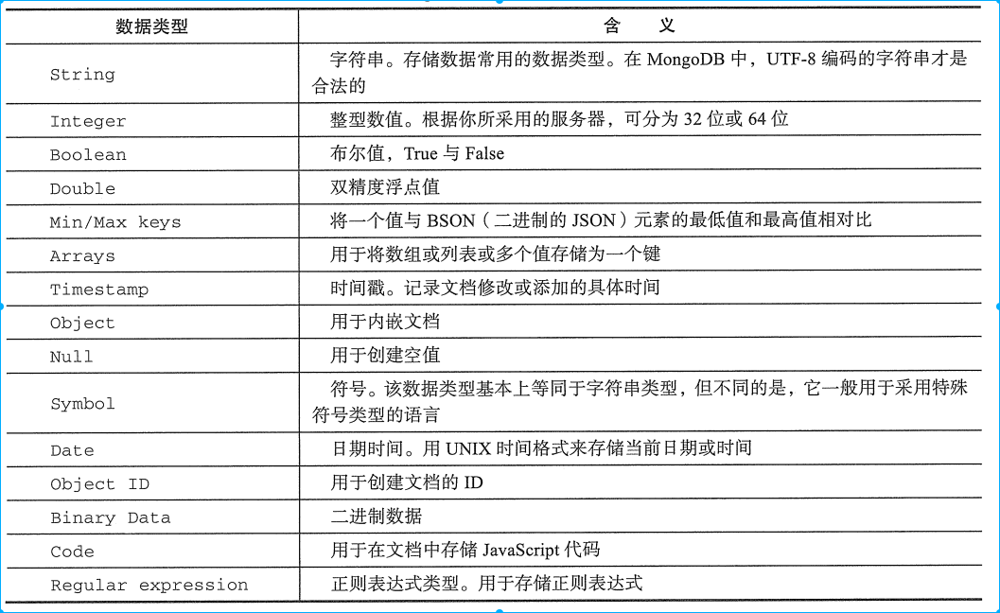
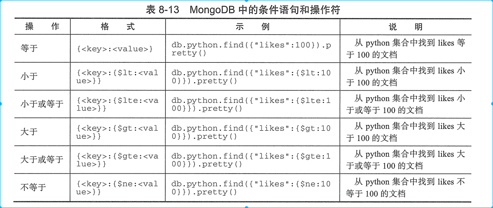
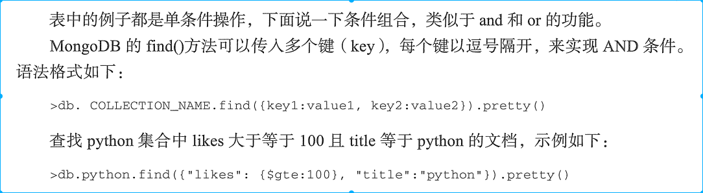
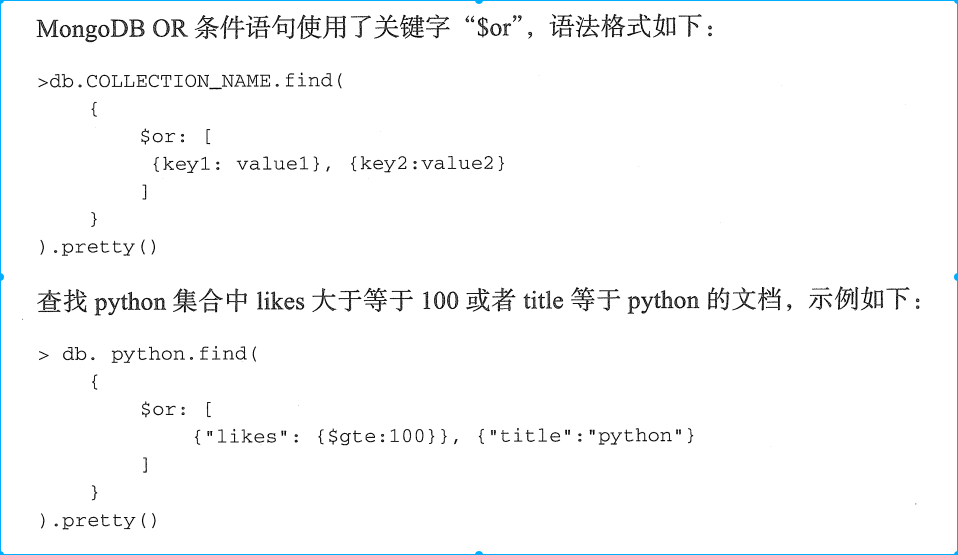
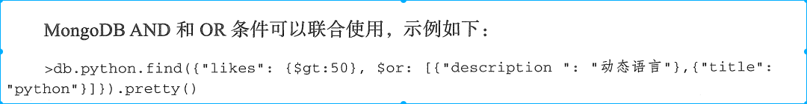
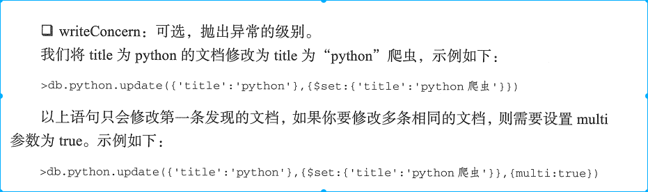
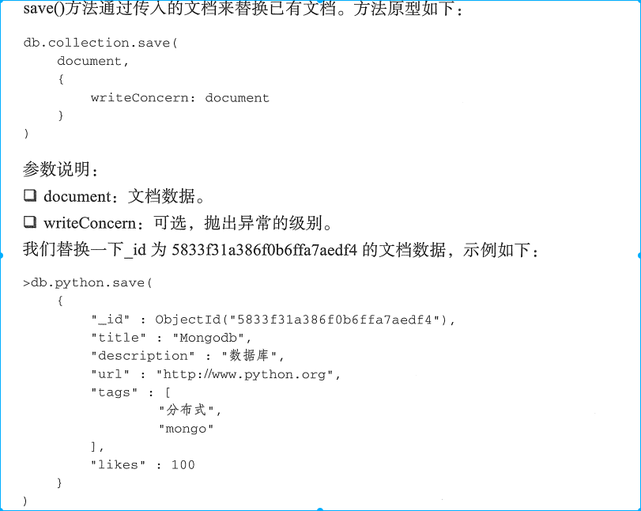
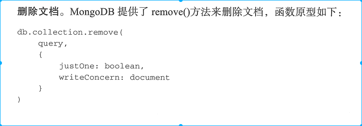
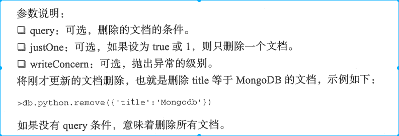

# MongoDB

## 文档
文档 - 文档是MongoDB中数据的基本单元，类似关系型数据库中的行。文档有唯一的标识`_id`, 数据库可自动生成。
文档以 key/value 的方式， 比如 {"name": "qiye", "age":20}, 可类比数据表的列名，以及列对应的值。
 
### 文档的三个特性
1. 文档的键值对是有序的，顺序不同文档亦不同。
2. 文档的值可以是字符串、整数、数组以及文档等类型。
3. 文档的键是用双引号标识的字符串(常见的);要求如下：键不能含有 `\0`（空字符）, 这个字符用来标识键的结尾；
`.` 和 `$` 被保留，存在特别含义；以 `_`的键是保留的
4. 文档区分大小写以及值类型

## 集合
集合在 MongoDB 中是一组文档，类似关系型数据库中的数据表。集合存在于数据库中，集合没有固定的结构，这意味着你在集合中可以插入不同格式和类型的数据(文档)。

## 数据库
一个MongoDB 中可以建立多个数据库， 默认数据库为 "db", 该数据库存储在 data 目录中。MongdoDB的单个实例可以容纳多个独立的数据库，每一个都有自己的集合和权限，不同的数据库也放置在不同的文件中。
在 MongoDB 的shell 窗口中， 使用 show dbs 命令可以查看所有的数据库， 使用 db 命令可以看当前的数据库。


## 常见数据类型




## 基本操作
1. mongod 启动mongo service
2. mongo 启动mongo client

### 创建/删除数据库
1. `use DATABASE_NAME` - 如果数据库不存在，则创建数据库，否则切换到指定数据库。
2. `show dbs` - 查看所有数据库，但是数据库中如果没有数据，就显示不出来。
3. `db.dropDatabase()` - 此语句可以删除当前数据库
4. MongoDB里的collection和数据库都是惰性创建的，创建库和集合的命令并没有对MongoDB Server进行任何操作。直到第一个文档插入后，才会创建，这就是为什么在不插入文档之前，使用show dbs 查看不到之前创建的数据库。

### 集合中文档的增删改查

#### 插入文档
MongoDB 使用 insert() 或 save() 方法向集合中插入文档： `db.COLLECTION_NAME.insert(document)`
示例： 
`db.python.insert({title: 'python', description: '动态语言', url: 'http://www.python.org', tags: ['动态', '编成', '脚本'], likes: 100})`
python 是我们的集合名称，如果该集合不在该数据库中，MongoDB会自动创建该集合并插入文档。

#### 查询文档
MongoDB 使用 find() 方法从集合中查询文档： 
1. `db.COLLECTION_NAME.find()` - 相当于 `select * from table`
2. `db.COLLECTION_NAME.find().pretty()` - 以易读的方式显示数据






#### 更新文档





#### 删除文档




## Python 操作 MongoDB
`pip install pymongo`

1. 建立连接
> pymongo 模块使用 MongoClient 对象来描述一个数据库客户端，创建对象所需的参数主要是host 和 port

    - client = pymongo.MongoClient() - 连接默认的主机IP和端口
    - client = pymongo.MongoClient('localhost', 27017) - 显示指定IP和端口
    - client = pymongo.MongoClient('mongodb://localhost:27017/') - 采用URL格式进行连接

2. 获取数据库
> 一个MongoDB 实例可以支持多个独立的数据库。使用pymongo时，可以通过访问MongoClient的属性的方式来访问数据库

    - `db = client.papers`
    - 如果数据库名字导致属性访问方式不都能用(比如pa-pers), 可以通过字典的方式访问
    - `db = client['pa-pers']`

3. 获取一个集合
> 一个collection指一组存在于MongoDB中的文档，获取Collection方法与获取数据库方法一致
    - collection = db.books
    - collection = db['books']

4. 插入文档
> 数据在MongoDB中是以JSON类文件的形式保存起来的。在PyMongo中用字典来代表文档，使用insert()方法插入文档。文档被插入之后，如果文档内没有`_id`这个键值，那么系统自动添加一个到文件里。这是一个特殊键值，它的值在整个collection里是唯一的。insert() 返回这个文件的`_id`值

    ```python
    book = {"author": "Mike", "text": "My first book!", "tags": ["爬虫", "Python", "网络"], "date": datetime.datetime.utcnow()}
    book1 = {"author": "Mike", "text": "My first book!", "tags": ["爬虫", "Python", "网络"], "date": datetime.datetime.utcnow()}
    book2 = {"author": "Mike", "text": "My first book!", "tags": ["爬虫", "Python", "网络"], "date": datetime.datetime.utcnow()}
    book_id = collection.insert(book)
    books = [book1, book2]
    books_id = collection.insert(books)

    ```
5. 查询文档
> MongoDB中最基本的查询就是`find_one`. 这个函数返回一个符合查询的文档，或者在没有匹配的时候返回None. 返回结果是一个之前插入的符合条件的字典类型值。获取多个文档，可以使用find()方法。find()返回一个Cursor实例，通过它我们可以获取每个符合查询条件的文档。

    ```python
    collection.find_one()
    # 筛选出 author 为 qiye的文档
    collection.find_one({"author": "qiye"})
    # 通过 _id也可以进行查询, book_id 就是返回的id对象，类型为ObjectId
    # 这个常用于Web应用，可以从URL抽取id, 从数据库中进行查询
    collection.find_one({"_id": ObjectId("5bad73fb0f26bb9606c517c5")})
    # find() 获取多个文档
    for book in collection.find():
	print(book)
    # 查询符合条件的文档有多少, 可以用count() 操作，而不必进行完整的查询
    collection.find({"author": "qiye"}).count()
    ```
6. 修改文档
> update() 和 save()
    
    ```python
    collection.update({"author: "qiye"}, {"$set": {"text": "python book"}})
    ```
7. 删除文档
> remove()

    ```python
    collection.remove({"author": "qiye"})
    ```
