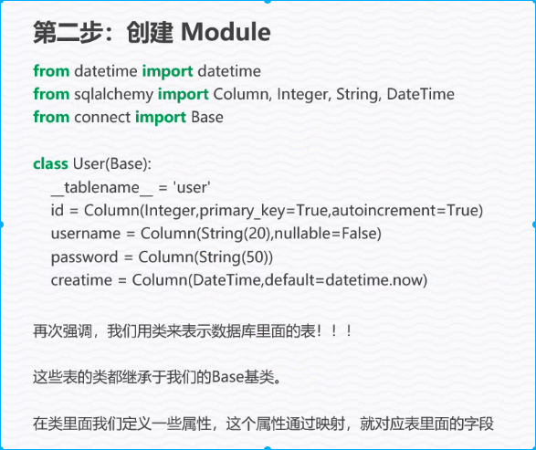
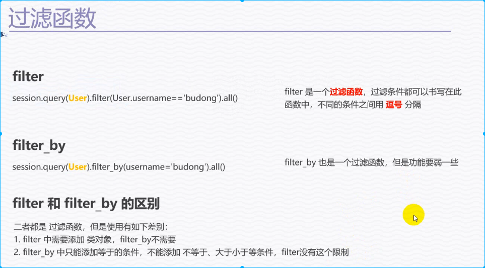
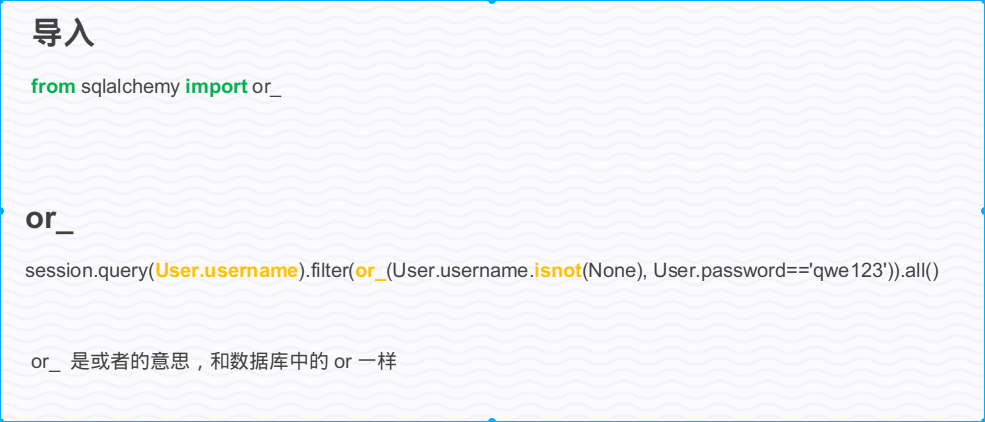

# ORM and SQLAlchemy

## ORM
ORM 全称 Object Relational Mapping 对象关系映射。通过ORM可以不用关心
后台是使用的哪种数据库，只需要按照ORM所提供的语法规则去书写相应的代码，
ORM就会自动的转换成对应数据库的SQL语句。

## SQLAlchemy
SQLAlchemy是Python SQL工具包和对象关系映射器，它为应用程序开发人员提供了SQL的全部功能和灵活性。它提供了一整套众所周知的企业级持久性模式，旨在实现高效，高性能的数据库访问，并采用简单的Pythonic域语言。


### SQLAlchemy 使用
使用之前需要先安装 sqlalchemy 和 pymysql 这两个包。

#### 连接数据库
```python
from sqlalchemy import create_engine
from sqlalchemy.ext.declarative import declarative_base

DATABASES = {
    'HOSTNAME': '127.0.0.1',
    'PORT': '3306',
    'USERNAME': 'root',
    'PASSWORD': 'Khalid0806.',
    'DATABASE': 'test_tornado',
}

db_url = ("mysql+pymysql://{USERNAME}:{PASSWORD}@{HOSTNAME}:"
          "{PORT}/{DATABASE}?charset=utf8".format(**DATABASES))

engine = create_engine(db_url)
# Base 作为模型类的基类
Base = declarative_base(engine)

def test_connect():
    """数据库连接测试"""
    conn = engine.connect()
    q = conn.execute("select 1")
    print(q.fetchone())


if __name__ == "__main__":
    test_connect()

```
#### 创建模型





```python
from sqlalchemy import Column, Integer, String, DateTime

from datetime import datetime
from connect import Base

class User(Base):
    __tablename__="user"
    id = Column(Integer, primary_key=True, autoincrement=True)
    name=Column(String(20), nullable=False)
    password=Column(String(50))
    createtime=Column(DateTime, default=datetime.now)

    def __repr__(self):
        return ("<User(id={}, name={}, password={}," 
                "createtime={})>".format(
                    self.id,
                    self.name,
                    self.password,
                    self.createtime)
                )


if __name__ == "__main__":
    Base.metadata.create_all()

```
#### 数据操作


```python
from sqlalchemy.orm import sessionmaker

from connect import engine
from user_module import User

# Step 1 创建session
Session = sessionmaker(engine)
session = Session()

def add():
    # 暂时没法插入中文
    # Add one row
    session.add(User(name="kongdecheng", password="123456"))
    # Add multiple rows
    session.add_all([
        User(name="yuanfei", password="123456"),
        User(name="zhangwei", password="123456"),
        User(name="lixiao", password="123456"),
        User(name="zhouteng", password="123456"),
    ])
    session.commit()

def query():
    # 查询User表的所有行
    all_rows = session.query(User).all()
    # 查询第一行
    first_row = session.query(User).first()

    print(all_rows)
    print(first_row)

def update():
    # return a Query obj
    q = session.query(User).filter(User.name=="kongdecheng")
    q.update({
        User.password: 567890
    })
    session.commit()

def delete():
    q = session.query(User).filter(User.name=="lixiao")[0]
    session.delete(q)
    session.commit()

```

#### 查询

##### 查询结果


##### 过滤函数


##### 模糊查询 


##### 查询结果数 


##### 排序 


##### 函数


##### 聚合函数


##### 其他函数


##### 选择条件



