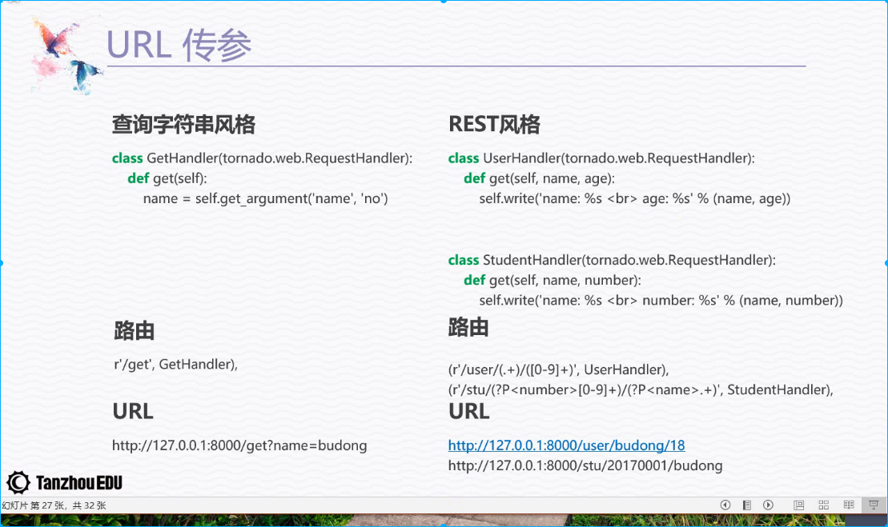

# Tornado


**Install: **`pip install tornado==4.5.0`


## Basic Use

```python
# 基础web框架模块
import tornado.web
# 核心IO循环模块，封装了Linux的Epoll和BSD的kqueue
import tornado.ioloop


# TODO [User's guide](http://www.tornadoweb.org/en/stable/)

class MainHandler(tornado.web.RequestHandler):
    def get(self, *args, **kwargs):
        self.write("Hello, World!")


def make_app():
    return tornado.web.Application([
        (r"/", MainHandler),
    ])


if __name__ == "__main__":
    app = make_app()
    # 绑定监听端口
    app.listen(8888)
    # IOLoop.current() 返回当前线程的IOLoop实例
    # IOLoop.start() 启动IOLoop 实例的I/O循环， 同时开启了监听客户端的连接
    tornado.ioloop.IOLoop.current().start()

```


## 使用命令行来控制tornado 启动

```python
"""
使用命令行来控制tornado 启动
"""

import tornado.ioloop
import tornado.web

from tornado.httpserver import HTTPServer # 一个单线程的HTTP服务器
from tornado.options import options  # 自定义命令选项模块


class MainHandler(tornado.web.RequestHandler):

    def get(self, *args, **kwargs):
        self.write("Hello, World!")


def make_app():
    return tornado.web.Application(
        handlers=[
            (r'/', MainHandler),
        ]
    )


if __name__ == "__main__":
    # 可以在终端直接 python file --port=8080
    # help: python file --help 显示自定义命令的帮助信息
    # port 自定义命令 port
    options.define('port', default=8000, help='run port', type=int)
    options.parse_command_line() # 解析终端输入的命令
    http_server = HTTPServer(make_app())
    http_server.listen(options.port)
    tornado.ioloop.IOLoop.current().start()
```

### 处理get请求的参数

```python
    # url: http://127.0.0.1:9000/?username=ABU&password=kaduoxi
    # url: http://127.0.0.1:9000/?name=ABU&name=kaduoxi
    def get(self, *args, **kwargs):
        # 获取username参数的值
        name = self.get_argument('username', default=None)
        # 获取所有的name参数的值, -> list
        names = self.get_arguments('name')
        passwd = self.get_argument('password', default=None)
        if name and passwd:
            self.write("<h1>{}</h1><h1>{}</h1>".format(name, passwd))
        else:
            self.write("Hello, World!")
```

### Input



**获取查询字符串及body体参数的方法:**
```python
# query param and body param [get one arg if has more params, get last one] 
get_argument(key, default=None) 
# [get all params return a list of params]
get_arguments(key)
# only query
get_query_argument(key, default=None)
get_query_arguments(key)
# only body
get_body_argument(key, default=None)
get_body_arguments(key)


```
### Output
1. `render(template_name)` - 返回 html 文件
2. `write(chunk)` 
    - 接受bytes, unicode and dict, 
    - 保存到缓冲区中，请求处理完成输出到浏览器, 
    - 调用flush()方法刷新缓冲区, 将内容返回给浏览器
    - 传入dict 会更改响应头的content type = application/json
    - 调用finish() 可以结束请求处理，直接返回请求结果
3. `redirect(url)` - 跳转到指定的路由

### Application 参数含义
1. `handlers=[]` 配置路由表 每个路由规则放在tuple里
2. `debug=True` 调试模式, 代码改动，自动重新启动服务器
3. `template_path='templates'` 模板文件的根目录


