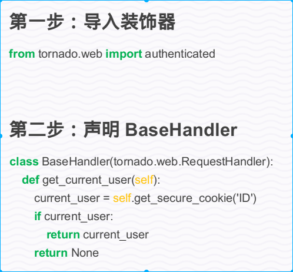

# Tornado


**Install: **`pip install tornado==4.5.0`


## Basic Use

```python
# 基础web框架模块
import tornado.web
# 核心IO循环模块，封装了Linux的Epoll和BSD的kqueue
import tornado.ioloop


# TODO [User's guide](http://www.tornadoweb.org/en/stable/)

class MainHandler(tornado.web.RequestHandler):
    def get(self, *args, **kwargs):
        self.write("Hello, World!")


def make_app():
    return tornado.web.Application([
        (r"/", MainHandler),
    ])


if __name__ == "__main__":
    app = make_app()
    # 绑定监听端口
    app.listen(8888)
    # IOLoop.current() 返回当前线程的IOLoop实例
    # IOLoop.start() 启动IOLoop 实例的I/O循环， 同时开启了监听客户端的连接
    tornado.ioloop.IOLoop.current().start()

```


## 使用命令行来控制tornado 启动

```python
"""
使用命令行来控制tornado 启动
"""

import tornado.ioloop
import tornado.web

from tornado.httpserver import HTTPServer # 一个单线程的HTTP服务器
from tornado.options import options  # 自定义命令选项模块


class MainHandler(tornado.web.RequestHandler):

    def get(self, *args, **kwargs):
        self.write("Hello, World!")


def make_app():
    return tornado.web.Application(
        handlers=[
            (r'/', MainHandler),
        ]
    )


if __name__ == "__main__":
    # 可以在终端直接 python file --port=8080
    # help: python file --help 显示自定义命令的帮助信息
    # port 自定义命令 port
    options.define('port', default=8000, help='run port', type=int)
    options.parse_command_line() # 解析终端输入的命令
    http_server = HTTPServer(make_app())
    http_server.listen(options.port)
    tornado.ioloop.IOLoop.current().start()
```

### 处理get请求的参数

```python
    # url: http://127.0.0.1:9000/?username=ABU&password=kaduoxi
    # url: http://127.0.0.1:9000/?name=ABU&name=kaduoxi
    def get(self, *args, **kwargs):
        # 获取username参数的值
        name = self.get_argument('username', default=None)
        # 获取所有的name参数的值, -> list
        names = self.get_arguments('name')
        passwd = self.get_argument('password', default=None)
        if name and passwd:
            self.write("<h1>{}</h1><h1>{}</h1>".format(name, passwd))
        else:
            self.write("Hello, World!")
```

### Input


**获取查询字符串及body体参数的方法:**
```python
# query param and body param [get one arg if has more params, get last one] 
get_argument(key, default=None) 
# [get all params return a list of params]
get_arguments(key)
# only query
get_query_argument(key, default=None)
get_query_arguments(key)
# only body
get_body_argument(key, default=None)
get_body_arguments(key)


```
### Output
1. `render(template_name)` - 返回 html 文件
2. `write(chunk)` 
    - 接受bytes, unicode and dict, 
    - 保存到缓冲区中，请求处理完成输出到浏览器, 
    - 调用flush()方法刷新缓冲区, 将内容返回给浏览器
    - 传入dict 会更改响应头的content type = application/json
    - 调用finish() 可以结束请求处理，直接返回请求结果
3. `redirect(url)` - 跳转到指定的路由


### Application 参数含义
1. `handlers=[]` 配置路由表 每个路由规则放在tuple里
2. `debug=True` 调试模式, 代码改动，自动重新启动服务器
3. `template_path='templates'` 模板文件的根目录
4. `autoescape=None` 整个项目全部取消特殊字符转义
5. `static_path='statics'` 静态文件的根目录

### 响应头的设置
1. `set_header(name, value)` - sets the given response header name and value.
2. `add_header(name, value)` - adds the given response header name and value. Unlike `set_header`, `add_header` may be called multiple times
    to return multiple values for the same header.
3. `clear_header(name)` - Clears an outgoing header, undoing a previous `set_header` call. Note that this method does not apply to multi-valued headers
    set by `add_header`.

### 错误处理(路由错误，返回404页面)
1. `send_error(status_code=500,**kwargs)` - Sends the given HTTP error code to the browser.
2. `send_error` 内部实现调用了`write_error()` 所以可以通过重写`write_error` 来实现自定义错误响应页面
3. `set_status(code,status)`, 设置响应状态
4. `r'/(.*)', utils.NotFoundHandler)` 定义404路由，放在路由表的最后 

### 请求处理流程


### 静态文件的引用


### Template Grammer


```
render() 通过关键字传参数的方式为模板填充动态数据

{{ expression }} return 后可以写的python表达式都可以写 
 其他模板指令 


 ...

 ...
  end 是结束代码块的标记


 ...


 set 是变量赋值指示符

 {{ a }}
 


{#...#} 在模板中注释python表达式的运行
{{! 1+1 }} 加上!会取消模板渲染, 页面会显示 {{ 1+1 }}
{#!
{%!
```

**其他模板指令**


#### 模板转义


```
默认会将字符串中的特殊符号进行转义，所以后台发送的html代码会作为普通字符串解析
 使用raw指令可以进行局部取消转义
 整个模板文件中取消转义
{{ escape(...) }} 转义字符串
```


#### 模板继承


```
 
...

```

#### 函数和类的导入


#### ui_methods and ui_modules


#### 实例

[TODO 图片上传失败]


### Cookie


### 登陆验证
我们希望用户只需要在第一次登录的时候输入用户名和密码，之后可以自动登录，不需要再次输入用户名和密码，也就是说在用户第二次访问的时候，服务器能够自动的验证用户登录信息，那么如何实现自动验证的功能呢？




```
authenticated 装饰器的功能

进行身份验证(针对特殊操作)
1. 验证成功，执行操作
2. 验证失败，跳转到登陆页面
```

在完成登录之后，再来看看，我们从一个路由跳转到登录页面之后，再完成登录之后，该如何跳转到之前的页面呢？


### Session
cookie 中的信息可以用来保存用户的登录信息，但是coolkie 是很容易被拦截的，所有其中必定不能有用户的任何私密信息，那么又有什么办法可以让服务器保存用户的登录信息，但是cookie中又不会有用户的任何信息呢?


### XSRF 跨站伪造请求防范


