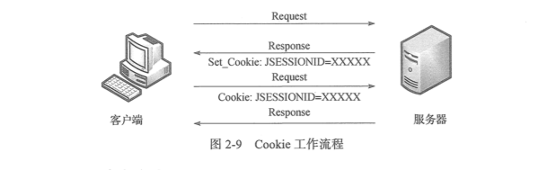

# HTTP 标准

HTTP协议（HyperText Transfer Protocol, 超文本传输协议）是用于从WWW服务器传输超文本到本地浏览器的传送协议。它可以使浏览器更加高效，减少网络传输。它不仅保证计算机正确快速地传输超文本文档，还确定传输文档中的哪一部分，以及哪部分内容首先显示（如文本先于图形）等。

## HTTP 请求过程

HTTP 协议采取的是请求相应模型，HTTP协议永远都是客户端发起请求，服务器回送响应。

HTTP 协议是一个无状态的协议，同一个客户端的这次请求和上次请求没有对应关系。一次HTTP操作称为一个事务，其执行过程可分为四步：

1. 首先客户端与服务器建立链接，例如单机某个超链接，HTTP的工作就开始了。
2. 建立链接后，客户端发送一个请求给服务器，请求方式的格式为：统一资源标识符（URL）、协议版本号，后面是 MIME 信息， 包括请求修饰符、客户机信息和可能的内容。
3. 服务器接到请求后，给予相应的响应信息，其格式为一个状态行，包括信息的协议版本号、一个成功或错误的代码，后边是MIME信息，包括服务器信息、实体信息和可能的内容。
4. 客户端接收服务器所返回的信息，通过浏览器将信息显示在用户的显示屏上，然后客户端与服务器断开连接。

如果以上过程中的某一步出现错误，那么产生错误的信息将返回到客户端，在显示屏输出，这些过程是由HTTP 协议自己完成的。

## HTTP 状态码含义

当浏览者访问一个网页时，浏览者的浏览器会向网页所在服务器发出请求。在浏览器接收并显示网页前，此网页所在的服务器会返回一个包含HTTP状态码的信息头（server header）用以响应浏览器的请求。HTTP状态码主要是为了标识此次HTTP请求的运行状态。下面是常见的HTTP状态码：

1. 200 请求成功
2. 301 资源（网页等）被永久转移到其他URL
3. 404 请求的资源（网页等）不存在
4. 500 内部服务器错误

HTTP状态码由三个十进制数字组成，第一个十进制数字定义了状态码的类型。HTTP状态码分为5种类型：

| 分类 | 分类描述                                       |
| ---- | ---------------------------------------------- |
| 1**  | 信息，服务器收到请求，需要请求者继续执行操作   |
| 2**  | 成功，操作被成功接收并处理                     |
| 3**  | 重定向，需要进一步的操作以完成请求             |
| 4**  | 客户端错误，请求包含语法错误或无法完成请求     |
| 5**  | 服务器错误，服务器在处理请求的过程中发生了错误 |

## HTTP 头部信息

HTTP 头部信息由众多的头域组成，每个头域由一个域名、冒号（：）和域值三部分组成。域名是大小写无关的，域值前可以添加任何数量的空格符，头域可以被扩展为多行，在每行开始处，使用至少一个空格或制表符。

例请求头：

```
:authority: www.cnblogs.com
:method: GET
:path: /
:scheme: https
accept: text/html,application/xhtml+xml,application/xml;q=0.9,image/webp,image/apng,*/*;q=0.8
accept-encoding: gzip, deflate, br
accept-language: zh-CN,zh;q=0.9,en;q=0.8
cache-control: max-age=0
cookie: UM_distinctid=164fe46c4886c5-0dc2574675ef42-163e6952-13c680-164fe46c48a73; CNZZDATA4059881=cnzz_eid%3D595723656-1533271392-https%253A%252F%252Fwww.google.com.hk%252F%26ntime%3D1533269429; _ga=GA1.2.546743655.1533274409; _gid=GA1.2.619248239.1533607534
if-modified-since: Tue, 07 Aug 2018 02:05:26 GMT
upgrade-insecure-requests: 1
user-agent: Mozilla/5.0 (Macintosh; Intel Mac OS X 10_13_3) AppleWebKit/537.36 (KHTML, like Gecko) Chrome/67.0.3396.99 Safari/537.36
```

1. method: GET  表示请求方式
2. user-agent: 里面包含出发出请求的用户信息，其中有使用的浏览器型号、版本和操作系统的信息。这个头域经常用来作为反爬虫的措施。

**TODO**


## Cookie 状态管理

Cookie 和 Session 都用来保存状态信息，都是保存客户端状态的机制，它们都是为了解决 HTTP无状态的问题所做的努力。对于爬虫开发来说，我们更加关注的是Cookie，因为Cookie将状态保存在客户端，Session将状态保存在服务器端。

Cookie 是服务器在本地机器上存储的小段文本并随每一个请求发送至同一个服务器。网络服务器用HTTP头向客户端发送Cookie，浏览器则会解析这些Cookie并将它们保存为一个本地文件，它会自动将统一服务器的任何请求绑定上这些Cookie。

Cookie 的工作方式：服务器给每个Session分配一个唯一的 JSESSIONID， 并通过Cookie发送给客户端。当客户端发起新的请求的时候，将在Cookie头中携带这个JSESSIONID。这样服务器能够找到这个客户端对应的Session。



## HTTP 请求方式

其中常用的请求方式是GET 和 POST：

- GET 方式： 是以实体的方式得到由请求URL所指定资源的信息， 如果请求URL只是一个数据产生过程， 那么最终要在响应实体中返回的是处理过程的结果所指向的资源，而不是处理过程的描述。
- POST方式：用来向目的服务器发出请求，要求它接受被附在请求后的实体，并把它当作请求队列中请求URL所指定资源的附加新子项。

区别：

- 在客户端，GET方式通过URL提交数据，数据在URL中可以看到，POST 方式，数据放置在实体内提交。
- GET方式提交的数据最多只能由1024字节，而POST则没有此限制。
- 安全性问题。使用GET的时候，参数会显示在地址栏上，而POST不会。所以，如果这些数据是非敏感数据，那么使用GET；如果用户输入的数据包含敏感数据，那么还是使用POST为好。

在爬虫开发中基本处理的也是GET 和 POST请求。 GET请求在访问网页时很常见，POST请求则是常用在登录框、提交框的位置。