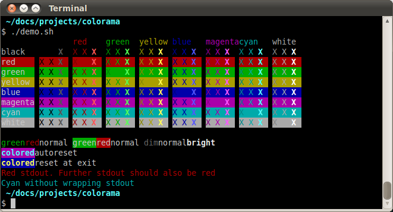

# colorama

> 简单的跨平台API，用于从Python打印彩色终端文本

## Demo



## How to use?

```python
from colorama import init
# windows平台需要额外调用以下方法
init()
# 要在程序退出之前停止使用colorama
deinit()
# 要再次使用Colorama
reinit()

# 彩色输出
from colorama import Fore, Back, Style
print(Fore.RED + 'some red text')
print(Back.GREEN + 'and with a green background')
print(Style.DIM + 'and in dim text')
# reset to default color, 程序在退出的时候自动执行此重置语句
print(Style.RESET_ALL)
print('back to normal now')

""" 可用的格式化常量, 全是ANSI字符
Fore: BLACK, RED, GREEN, YELLOW, BLUE, MAGENTA, CYAN, WHITE, RESET.
Back: BLACK, RED, GREEN, YELLOW, BLUE, MAGENTA, CYAN, WHITE, RESET.
Style: DIM, NORMAL, BRIGHT, RESET_ALL
"""
```

