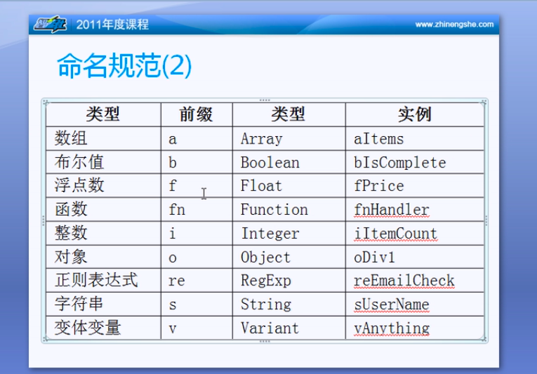
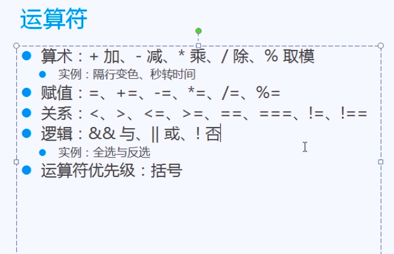
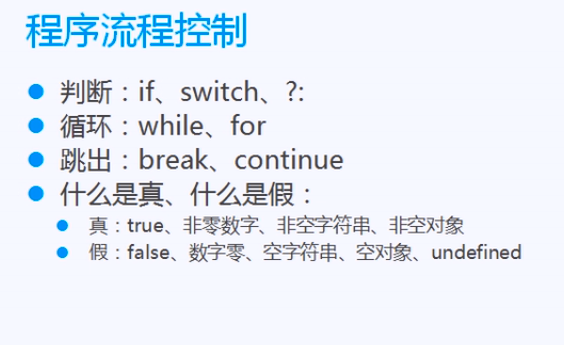
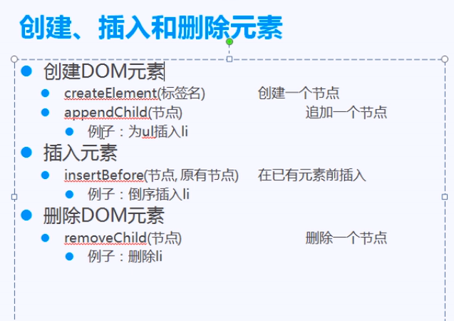

# JavaScript 手记


## 1. 什么是JS？

修改网页的样式

**编写 JS的流程**

1. 布局： HTML+CSS
2. 属性：确定要修改哪些属性
3. 事件：确定用户做哪些操作（产品设计）
4. 编写JS：在事件中，用JS来修改页面元素的样式


## 数据类型转换
1. parseInt() 转为整数
2. parseFloat() 转为浮点数
3. isNaN() 判断是否为NaN
4. == 先转换类型，然后比较
5. === 不转换类型，直接比较

## 变量作用域和闭包
1. 局部变量：函数内定义的变量，只能在自身函数内使用
2. 全局变量：函数体外定义的变量，作用范围在整个 script 标签内
3. 闭包：子函数可以使用父函数的局部变量

## 命名规范，匈牙利命名法
1. 类型前缀
2. 首字母大写



## 运算符



## 程序流程控制



## JSON
1. 类似Python的字典,在JS里叫做JSON
2. 与数组的区别：JSON没有length属性
3. JS 也有 for in 循环, 因为JSON没有length 属性，所以推荐使用for in 循环

## 继续深入JS
1. 函数返回值
2. 函数传参
  - arguments - 用来接收不定参数的数组，相当于python的`*args`
  ```JavaScript
  function sum () {
    var result = 0;
    for (var i=0;i<arguments.length;i++) {
      result+=arguments[i];
    }
    return result;
  }

  alert(sum(2,3,4,5));
  ```
  - 利用不定参 arguments 实现一个可以查看或修改对象任意样式的函数
  ```JavaScript
  function css(obj, name, value) {
    // arguments[0] == obj
    // arguments[1] == name
    // arguments[2] == value

      if (arguments.length == 2) {
        alert(obj.style[name]);
      } else {
        obj.style[name] = value;
      }
    }
    var oDiv = document.getElementById('div1');
    css(oDiv, "background"); // 查看属性值
    css(oDiv, "background", "blue"); // 设置属性值
  ```
3. obj.style 获取行间样式, obj.currentStyle 获取非行间样式, getComputedStyle() 获取非行间样式

```JavaScript
alert(getComputedStyle(oDiv, null).width);
// 第二个参数传什么都可以
```

## 数组基础
1. 数组定义
```JavaScript
var a = [1,2,3];
var aB = new Array(1,2,3);
// 没有任何差别，[]的性能略高，因为代码短。
```
2. 属性length, 既可以获取数组长度，也可以设置数组长度，例如`a.length=0`, 则数组被清空。
3. 数组使用原则：数组中应该只存一种类型的变量
4. 添加，删除元素
  - push(e), 从尾部添加
  - unshift(e), 从头部添加
  - pop(), 从尾部弹出
  - shift(), 从头部弹出
5. splice的用法
```JavaScript
var arr = [1,2,3,4,5,6];
// 删除多个元素: splice(起点，长度)
arr.splice(2,3); // remove 3 4 5 from arr and arr = [1,2,6] now
// 插入多个元素: splice(插入位置, 0, i1, i2...)
arr.splice(1,0,'a','b','c');
// 替换多个元素: splice(起点, 长度，元素)
arr.plice(1,2, 'f','e');
```
6. 排序和转换
1. concat()
  ```JavaScript
    var arr1 = [1,2,3];
    var arr2 = [4,5,6];
    alert(arr1.concat(arr2)); // [1,2,3,4,5,6]
    alert(arr2.concat(arr1)); // [4,5,6,1,2,3]
  ```
2. join()
  ```JavaScript
    var arr = [1,2,3];
    alert(arr.join('-')); //alert 1-2-3
  ```
3. sort()
  ```JavaScript
    var arrInt = [1, 2, 3, 12, 112, 22, 23, 3];
    var arrStr = ['alpha', 'apple', 'zoom', 'float', 'double', 'margin', 'padding'];
    arrStr.sort(); // 默认字符串排序
    // 数字排序技巧
    arrInt.sort(function(n1, n2) {
      if (n1 < n2) {
        return -1;
      } else if (n1 > n2) {
        return 1;
      } else {
        return 0;
      }
    });
    // arrInt.sort(function (n1,n2) {return n1-n2;}); // 更快捷的方式
    alert(arrStr);
    alert(arrInt);
  ```

## 定时器
1. 开启定时器
  - setInterval(func, 1000) 间隔型(每间隔一段时间，将操作执行一次) 时间单位为毫秒
  - setTimeout 延时型(间隔一段时间后，执行操作,只执行一次)
  - 两种定时器的区别
2. 停止定时器
  - clearInterval
  - clearTimeout

3. 字符串方法 charAt() = python 里的 序列索引
4. Date 对象方法
  ```JavaScript
  var oDate = new Date();
  var iHours = oDate.getHours(); // 返回小时
  var iMinutes = oDate.getMinutes(); // 返回分钟
  var iSeconds = oDate.getSeconds(); // 返回秒
  var iYear = oDate.getFullYear(); //返回年
  var iMonth = oDate.getMonth()+1; //返回月
  var iDate = oDate.getDate(); //返回日
  var iDay = oDate.getDay(); //返回星期
  ```

## JS运动 知识暂停

## JS DOM
1. 节点=标签=元素
2. 获取节点(childNodes, children)
  ```JavaScript
<body>
  <ul>
    <li></li>
    <li></li>
    <li></li>
  </ul>
  <script type="text/javascript">
    var oUl = document.getElementsByTagName('ul')[0];
    // 空白在 Chrome 下算作文本节点
    // 4个空白(文本节点)+3个li(元素节点) = 7个节点
    var oLi = oUl.childNodes;
    // nodeType == 3 -> 文本节点
    // nodeType == 1 -> 元素节点
    for (var i=0;i<oUl.childNodes.length;i++) {
      alert(oLi[i].nodeType);
    }
    // children -> 返回元素节点数组
    alert(oUl.children.length);
    // 返回父节点对象
    var oNode = oUl.parentNode;
  </script>
</body>
  ```
3. offsetParent - (返回元素的实际位置)子元素绝对定位父元素相对定位, 返回相对定位的父元素，没有则返回body
4. 子节点
  ```html
<body>
  <ul>
    <li>1</li>
    <li>2</li>
    <li>3</li>
    <li>4</li>
    <li>5</li>
    <li>6</li>
    <li>7</li>
  </ul>
  <script type="text/javascript">
    var oUl = document.getElementsByTagName('ul')[0];
    // 将第一个节点元素的背景颜色设置为蓝色
    oUl.firstElementChild.style.background = "blue";
    // 将第最后一个节点元素的背景颜色设置为蓝色
    oUl.lastElementChild.style.background = "green";
    // 将下一个兄弟节点 <li>4</li>设置样式
    oUl.children[4].nextElementSibling.style.background = "red";
    // 将上一个兄弟节点 <li>6</li> 设置样式
    oUl.children[4].previousElementSibling.style.background = "yellow";
  </script>
</body>

  ```
5. 操作元素属性
  - setAttribute(名称, 值)
  - getAttribute(名称)
  - removeAttribute(名称)

6. 创建,添加,删除节点


## 表格应用


## 表单应用


## 空链接
```JavaScript
<a href="javascript:;">这是一个空链接</a>
```

## 表单事件
1. onsubmit - 提交表单时触发
2. onreset - 重置表单时触发

## 原生Ajax
1. 创建Ajax 对象
2. 连接到服务器
3. 发送请求
4. 接收返回值

## Jquery Ajax
1. `$.ajax()`
  ```html
  <!DOCTYPE html>
<html lang="en">

<head>
    <meta charset="UTF-8">
    <title>json+ajax</title>
    <style>
        input {
            width: 50px;
        }
    </style>
</head>
<body>

<section>
    <input id="number_a" type="text">+
    <input id="number_b" type="text">
    <button>=</button>
    <input id="result" type="text" name="result">
</section>

<script src=""></script>
<script>
    /**
     * 使用var声明的变量，其作用域为该语句所在的函数内，且存在变量提升现象；
     * 使用let声明的变量，范围在 {} 内
     * 使用const声明的是常量，在后面出现的代码中不能再修改该常量的值。
     */
    {#let jUser = {#}
    {#    'name': 'KongDecheng',#}
    {#    'age': 18,#}
    {#    'school': '清华大学'#}

    {#// 迭代 JSON 数据#}
    {#for (let k in jUser) {#}
    {#    console.log(k, jUser[k]);#}

    {#// 序列化 JSON 数据 为字符串#}
    {#let sUser = JSON.stringify(jUser);#}
    {#console.log(sUser);#}
    {#console.log(typeof sUser);#}
    {##}
    {#// 反序列化#}
    {#let jUserCopy = JSON.parse(sUser);#}
    {#console.log(typeof jUserCopy);#}
</script>

<script>
    let oResult = document.getElementById('result');
    let oBtn = document.getElementsByTagName('button')[0];
    oBtn.onclick = function () {
        let iA = document.getElementById('number_a').value;
        let iB = document.getElementById('number_b').value;
        $.ajax({
            cache: false,
            type: 'post',
            async: true,
            url: '',
            data: {a: iA, b: iB},
            beforeSend: function (xhr, settings) {
                xhr.setRequestHeader("X-CSRFToken", "{{ csrf_token }}");
            },
            success: function (data) {
                if (data['status'] === "success") {
                    oResult.value = data["result"];
                } else {
                    oResult.value = "未知结果";
                }
            },
        });
    };
    
</script>
</body>
</html>
  ```
2. `$.get()`
3. `$.post()`

 

## JS 实例

1. [case_1.html](js-src/case_1.html) - 鼠标提示框，鼠标悬浮在元素上，显示提示信息
2. [case_2.html](js-src/case_2.html) - 修改样式
3. [case_3.html](js-src/case_3.html) - 复选框全选，反选
4. [case_4.html](js-src/case_4.html) - 选项卡
5. [case_5.html](js-src/case_5.html) - 简易年历
6. [case_6.html](js-src/case_6.html) - 隔行变色
7. [case_7.html](js-src/case_7.html) - 时间换算
8. [case_8.html](js-src/case_8.html) - 间隔定时器使用
9. [case_9.html](js-src/case_9.html) - 延时定时器使用
10. [case_10.html](js-src/case_10.html) - 数码时钟 
11. [case_11.html](js-src/case_11.html) - 无缝滚动
12. TODO
13. [case_13.html](js-src/case_13.html) - 点击链接，隐藏父元素
14. [case_14.html](js-src/case_14.html) - 发布评论, 使用到创建节点，追加节点，以及插入节点
15. [case_15.html](js-src/case_15.html) - 删除评论, 使用到删除节点
16. [case_16.html](js-src/case_16.html) - 表格应用, 隔行变色, 高亮当前行，增加行，删除行，动态序号分配
17. TODO - 表格搜索 P13

