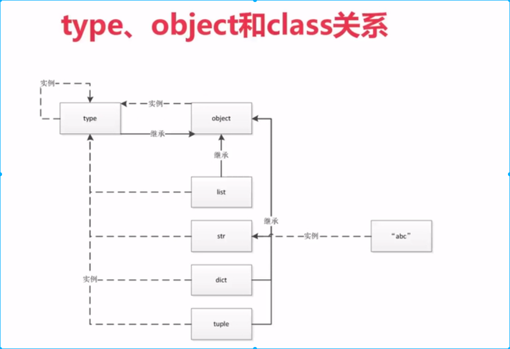

# Python 高级编程手记

## 1. 环境搭建(Ubuntu18+virtualenv+python3.7+Pycharm Pro)

1. 安装Python3依赖

```shell
sudo apt install build-essential python3-dev python3-setuptools python3-pip python3-smbus
sudo apt install build-essential libncursesw5-dev libgdbm-dev libc6-dev
sudo apt install zlib1g-dev libsqlite3-dev tk-dev
sudo apt install libssl-dev openssl
sudo apt install libffi-dev
```

2. 下载python3.7源码包，编译安装

```shell
# 1. Get python interpreter
wget https://www.python.org/ftp/python/3.7.0/Python-3.7.0.tar.xz
tar -xvf Python-3.7.0.tar.xz -C /tmp
cd /tmp/Python-3.7.0
# 2. Install python by source code compile
./configure --with-ssl --prefix=/usr/local
make
sudo make altinstall
# 3. Create soft link
sudo ln -s /usr/local/bin/pyhton3.7 /usr/bin/python37
sudo ln -s /usr/local/bin/pip3.7 /usr/bin/pip37
# tips: Install package via douban mirror
sudo pip3.7 install -i https://pypi.douban.com/simple package-name
```

3. 创建虚拟环境

```shell
mkvirtualenv -p /usr/bin/python37 env-python37
```


## 2. Python 中一切皆对象

1. 类是由type类生成的对象，我们平常所熟悉的对象是类对象生成的对象， 一句话：实例化type类，可以得到类对象，实例化类对象可以得到类对象的对象

   ```python
   # 对象 1 是int类的实例, int类是type类的实例
   In [1]: a = 1       
   In [2]: type(a)
   Out[2]: int
   In [3]: type(int)
   Out[3]: type
   # 对象 "Hello" 是str类的实例, str类是type类的实例
   In [1]: b = "Hello"       
   In [2]: type(b)
   Out[2]: str
   In [3]: type(str)
   Out[3]: type
   ```

2. object是顶层基类, 同时也是type类的对象

   ```python
   In [10]: int.__bases__ # 查看 int 类的父类（基类）
   Out[10]: (object,)
   In [11]: class Student:
   ...:     pass
   In [12]: class MyStudent(Student):
   ...:     pass
   In [13]: Student.__bases__
   Out[13]: (object,)
   In [14]: MyStudent.__bases__
   Out[14]: (__main__.Student,)
   # object是顶层基类, 同时也是type类的对象
   In [16]: object.__bases__
   Out[16]: ()
   In [19]: type(object)
   Out[19]: type 
   ```

3. class, object, type 之间的关系

   

4. 常见的内置类型

   ```python
   """对象的三个特征
   1. 身份（通过id(object)可以查看对象的内存地址）
   2. 类型
   3. 值
   """
   
   # None 全局只有一个，解释器在启动后，自动创建一个None对象
   In [20]: a=None
   In [21]: b=None
   In [22]: id(a)==id(b)
   Out[22]: True
   # 数值类型 int float complex bool
   # 迭代类型 1. list 2. bytes, bytearray, memoryview (二进制序列)
   # 		  3. range 4. tuple 5. str 6. array
   # 序列类型
   # 映射(dict)
   # 集合 1. set 2. frozenset
   # 上下文管理类型 with
   ```

5. 函数和类也是对象，属于Python的一等公民，以下是一等公民的特征：

   - 赋值给一个变量
   - 可以添加到集合对象中
   - 可以作为参数传递给函数
   - 可以当作函数的返回值

