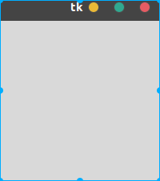
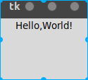
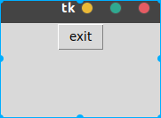

# Python GUI 编程序

## tkinter tkinter.tix tikinter.ttk
tkinter: python自带的GUI库
tix, ttk: 扩展了tkinter的组件

## GUI 编写流程
1. 建立界面
    - 创建组件
    - 布置组件
2. 注册事件处理器
3. 等待事件发生
    - 开启事件循环(监听可能的鼠标事件或者键盘事件)

## tkinter 编码流程
1. 从tkinter模块加载组件类
2. 创建组件类的实例
3. 在父组件中打包新组件
4. 调用主循环，显示窗口，同时开始tkinter的事件循环

## 创建组件
### 创建一个根窗口,并显示
```python
from tkinter import Tk
root = Tk()
# root.title("Hello.py") # 设置窗口的标题
root.mainloop()
```


```python
root.quit() # 销毁所有窗口, 结束事件循环
root.destroy() # 销毁当前窗口
```

一行代码创建窗口, 
```python
from tkinter import Tk
Tk().mainloop()
```
由于该窗口引用没有保存在python变量中，所以窗口对象在创建后，就被Python垃圾回收了, 但是由于已经发生了操作系统的Tk库的调用, 已经返回了真实的窗口,所以窗口会一直在屏幕上显示。
tkinter 只是一个通知 Tk 构建真实gui的模块, 在tkinter中创建gui对象，来告诉Tk要创建哪些真实的组件。

### 自定义组件的特性
1. 通过实例化组件类的时候，传入不同的参数来定制组件的外观
    - 第一个参数是父组件对象，传入`None`表示将新标签设置该程序的默认顶层窗口。
    - 其他参数作为关键字参数传入, 可以对组件的颜色，尺寸，回调函数进行设置。
2. 组件创建完成后，可以通过组件的config()方法来修改组件的样式。
    ```python
    label = Label()
    label.config(text="Hello,World!")
    label.config(bg="red")
    ```

### 布局管理器
1. pack 
    - **设置组件在父组件中的位置**, 顶部(side=tkinter.TOP)，底部(side=tkinter.BOTTOM)，左边(side=tkinter.LEFT)，右边(side=tkinter.RIGHT)
    - 安排组件有两个依据，一个是调用pack()函数的顺序，还有一个是边的选项设置。
    - **设置组件是否允许扩展(随着父组件的变大而变大，随着父组件的缩小而缩小)**, 默认是不允许扩展的, (expand=tkinter.YES)表示允许扩展, (fill=tkinter.X) 表示允许水平拉伸, (fill=tkinter.Y) 表示允许垂直拉伸，(fill=tkinter.BOTH)表示都允许。 只设置expand=YES, 会为组件收集所有可用空间, 但不会去填充空间。
     
### 组件
1. Label - 标签
    ```python
    Label(None, text="Hello,World!").pack()
    mainloop()
    ```
    

2. Button - 按钮
    ```python
    import sys

    Button(root, text="exit", command=sys.exit).pack()
    mainloop()
    ```
    

### 回调处理器
